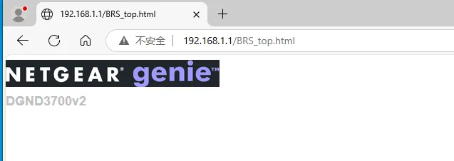
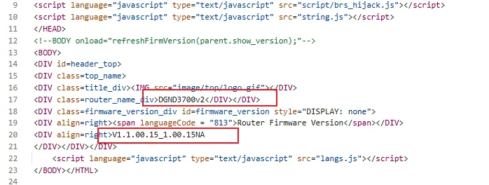

# Overview

- Manufacturer's website information：https://www.netgear.com/
- Firmware download address ：https://kb.netgear.com/23510/DGND3700v2-Firmware-Version-1-1-00-15-NA-Users

# Affected version

DGND3700v2 V1.1.00.15_1.00.15NA

# Vulnerability description

An information disclosure vulnerability exists in NETGEAR DGND3700v2 firmware V1.1.00.15_1.00.15NA, where the /BRS_top.html page is accessible without authentication. This allows unauthenticated users obtain sensitive device information such as the router model and firmware version.

# Poc

http://192.168.1.1/BRS_top.html

  

  
