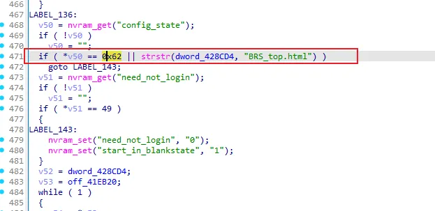
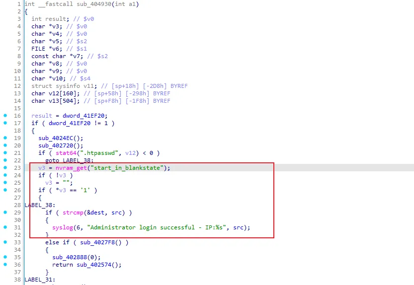
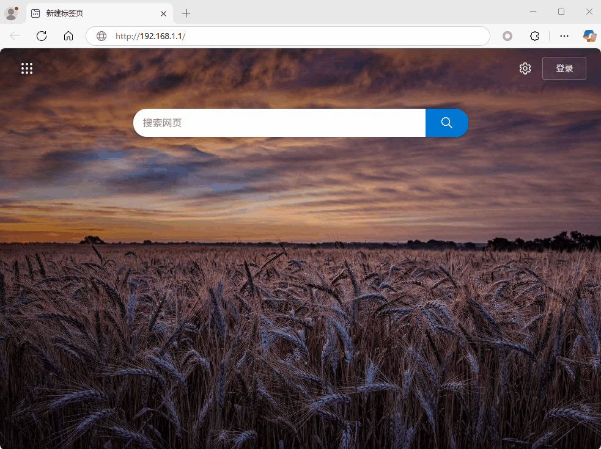

# Overview

- Manufacturer's website information：https://www.netgear.com/
- Firmware download address ：https://kb.netgear.com/23510/DGND3700v2-Firmware-Version-1-1-00-15-NA-Users

# Affected version

DGND3700v2 V1.1.00.15_1.00.15NA

# Vulnerability description

A backdoor authentication bypass vulnerability exists in the NETGEAR DGND3700v2 router (firmware V1.1.00.15_1.00.15NA). By accessing the unauthenticated endpoint `/BRS_top.html`, the internal flag `start_in_blankstate` is set to `1`, which disables HTTP Basic Authentication checks. As a result, an attacker can bypass login and gain full access to the device management interface without valid credentials.

# Vulnerability details

Mini_http is a lightweight HTTP server mainly used to provide basic services for device management interfaces (such as Web configuration pages). 

Netgear uses mini_http to handle HTTP requests, `sub_406058` is responsible for handling all incoming HTTP requests and generating appropriate responses. After accessing the `BRS_top.html` page, the `start_in_blankstate` flag will be set to `1`.

  

We cross-referenced the search for `start_in_blankstate`, and found that this flag is used in the `sub_404930` function. The `sub_404930` function is responsible for the HTTP Basic Auth login verification. If `start_in_blankstate=1`, the verification is skipped, allowing users to access all features without permissions, which appears to be a backdoor.

  

# Poc

We recorded a gif to prove this backdoor vulnerability.

